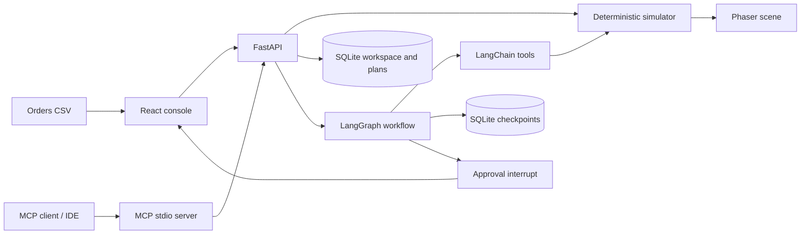

# Architecture and file map



## Files

```text
waypoint/
├── backend/
│   ├── app/
│   │   ├── main.py          FastAPI, validation, imports, plans, decisions, export
│   │   ├── simulation.py    Grid layout, BFS routing, ticks, metrics, counterfactuals
│   │   ├── storage.py       SQLite workspace and audit records
│   │   └── planner.py       LangChain tools and durable LangGraph workflow
│   ├── mcp_server.py       MCP stdio adapter, tools/resources/prompt
│   ├── requirements.txt    Direct dependency constraints
│   ├── requirements.lock   Tested resolved dependency versions
│   └── tests/              Simulation, API, durability and real MCP integration tests
├── frontend/
│   ├── src/
│   │   ├── main.tsx         React console and interactions
│   │   ├── Warehouse.tsx    Phaser scene and lifecycle
│   │   ├── types.ts         API contracts and helpers
│   │   └── styles.css       Responsive design system
│   ├── public/favicon.svg
│   ├── package-lock.json
│   └── vite.config.ts
├── sample-data/orders.csv
├── scripts/                Setup, start, checks, MCP configuration generator
├── docs/                   Architecture, FDE walkthrough, verification
├── .github/workflows/check.yml
├── .env.example
├── Dockerfile
├── compose.yaml
└── README.md
```

## One source of truth

FastAPI loads a snapshot, mutates it under an in-process lock, and commits it to SQLite. A tick assigns available robots, moves them along shortest paths, accounts for loading, and records deliveries. The browser advances time every 500 ms while playing, asking for 1, 2 or 4 ticks per call. It interpolates robot positions through Phaser tweens. Paused views refresh every four seconds to observe MCP actions. Playback is a client control, not a background worker; closing the browser stops UI-driven advancement.

## Planning state machine

The graph calls LangChain tools to inspect the current snapshot and simulate three policies. Its recommendation function ranks the results by the selected objective. The optional model receives metrics only, and cannot change the recommendation. `interrupt()` persists an approval checkpoint with a unique thread ID. The decision endpoint resumes it with `Command(resume=...)`.

The API rejects an approval if the workspace ID or configuration revision changed. It rejects a second decision on a reviewed plan. Graph resume is read-only with respect to the warehouse; the actual policy update and audit status are committed together in one SQLite transaction. If the process dies after graph resume but before that commit, a retry reads the completed checkpoint and recovers the same decision. A conflicting retry is rejected.

## API surface

| Method | Path | Purpose |
| --- | --- | --- |
| GET | `/api/health` | Health and planner mode |
| GET | `/api/workspace` | State, layout and derived metrics |
| POST | `/api/advance` | Advance 1–60 ticks |
| POST | `/api/incident` | Set aisle closure |
| POST | `/api/reset` | Load a fresh 48-order sample |
| POST | `/api/import` | Atomic CSV replacement |
| GET | `/api/sample.csv` | Download sample wave |
| POST | `/api/plans` | Run comparison and pause at approval |
| GET | `/api/plans` | Latest 50 plans |
| POST | `/api/plans/{id}/decision` | Resume approval/rejection |
| GET | `/api/export` | Download JSON report |

## Boundaries and assumptions

Run one API worker. SQLite connections are accessed under the process lock. A model explanation holds the lock and can delay other requests until its configured timeout; a production implementation should move planning into jobs. The MCP service delegates every mutation to the same API. No SSE/WebSocket stream is claimed: browser transport is bounded HTTP polling.

Writes reject unexpected browser Origins. Hosted mode requires an access secret of at least 24 characters; its sign-in endpoint issues an eight-hour session. A trusted local process or connected MCP client can operate the simulation. Hosted mode uses a shared access code, signed HttpOnly session cookies, login rate limiting and bearer authentication for MCP. There is no physical robot control, tenant isolation, per-user identity or role-based approval. Model mode must be configured explicitly; deterministic mode has no language-model network dependency.
